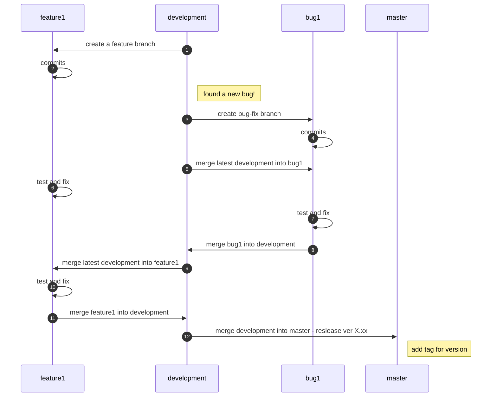
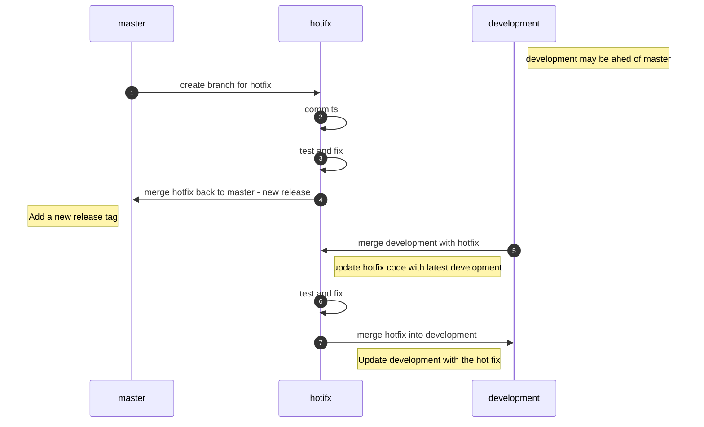

# Git Branching Methodology


### Motivation

Coding with a team requires avoiding mistakes such as overriding others code, accidentally pushing bugs into our app, or pushing the wrong code into the Git server... 
It also requires maintaining an anchor - a safe place where everyone can go back to and know that there - the app will work fine.
Also, each teammate should have its own workspace.

We can achieve all of this using Git, and several rules we define for ourselves - 
*The Branching Methodology*.

*Git Branching Methodology* **is coupled with** *User Story Methodology*.
**Please read them both before start working.**


> **Note:** here's some inspiration


# The BIG picture


### The Development Process




### Fixing an URGENT bug in already-released code (hotfix)




# Master branch

The *master* branch contains the latest **release**. Each release is identified with a **tag** containing the version number, so when we update *master* to a new version we can easily find the previous version.

The *master* branch is to merge only with *development* branch and hotfixes (as shown in the diagram above).

A merge into *master* will go throw a heavy review by project manager or so.


# Development branch

The *development* (dev) branch is for features integration, and should **always** be stable and never broken. 
Therefore, for any change, it should be proven that it will not break it before entering the branch. 

Same as *master*, before merging a new feature/fix into *dev* it should be tested thoroughly and go throw a heavy review.


# Branching

* New branches should be created from *development* branch (except for *hotfix*).
* Each branch should be related to a *User Story* and handle an issue. (see [User Story Methodoloy]()).
* Branches created for learning and so **should remain local. do not push them**.
* Branches are a private workspace. if you want to work on someone else's branch - **ask first**.


### Naming Conventions for web develop
* Each branch will start with prefix - *be/* or *fe/* according to the relation of the issue - backend or frontend.
* Hotfix will have prefix - *hotfix/*.
* Words inside branch name will be separated by '_' (lower dash).
* The name should be related to the issue it is handling.
> **Example:** *be/UD_channels*


### Naming Conventions for other development processes
Same as the above only prefix is different:
* *feature/* - for new features
* *bugfix/* - for bugs


# Commits
Commits are fragments of our work. 
Dividing your work into small commits makes it easier to for other, and for you to follow and review your work.
If something goes wrong, you can easily go back commit by commit to the source of the bug.

* Before committing - verify that you're on the right branch.
* Every commit should have a good description of the changes made in that commit.
Be accurate and to the point - **it's OK to write long descriptions as long as it's relevant.**
* Every commit should be linked to an issue - **everything we put in our code is for a reason**. 
Attach your commits to Shortcut User-Stories. The syntax is very simple, follow this [guide](https://help.shortcut.com/hc/en-us/articles/115003820646-Using-Commits-with-the-Shortcut-VCS-Integrations).
* Check what you add to a commit **(!!!)** - use ```git status, git add, git add --patch``` to put exactly what you wanted into a commit.

> **Note:** A very long commit description is a good sign to split your commit into a few.


# Merge Requests

A merge request will put all the work done in branch into another.
It is a major change, putting a lot of code from different files all at once, and should be taken care with caution.
You can merge into your branch whatever you like. As written above - it is your private workspace.
The *development* and *master* branches are common, which means everything merged into these branches will affect everyone!

* Before merging your branch into another, **especially** ***dev*** **branch**- merge it into yours. That way you will not **override it**, and you can solve *merge conflicts* on your branch (and not in everyone's branch).
* Attach all issues relevant to your merge. Everyone needs to know what you contributed. Not sure [how to do it?](https://help.shortcut.com/hc/en-us/articles/207540323-Using-Branches-and-Pull-Requests-with-the-Shortcut-VCS-Integrations)
* Merge requests into *development* and *master* **must** go through a review by project-manager or so. Please open them using GitLab interface and assign all relevant data to it (title, author, reviewer, description, attached issues, comments over the merge process and so).
* After merge to *dev* is done - delete the branch. No need to drag it.


### Merge Conflicts

Scary, I know, but it just means that you and someone else edited the same lines of code in the same file, and *git* don't know which of you holds "the truth".
It is an integral part of developers teamwork.

*Git* will mark in your files where is the conflict as following:

* To mark your changes - *git* will put your code in **HEAD** section 
(HEAD is your current branch or the branch you merge into).
* The ``========`` sign will be the separation between *your* part and *their* part (theirs is the branch your merging with).
* The part that ends with ``>>>>>`` is where the conflict ends.

It will look something like this:
``` 
<<<<<<< HEAD
	your code...
=======
	their code...
>>>>>>> their_branch_name
```


You can solve conflicts with whatever merge-tool you like, **as long as you are thorough** - manually, meld, beyondCompare, GitLab interface, VsCode extensions.

> **Note:** it is highly recommended to use a merge-tool (meld to be specific). Makes life easier.
>
> **Warning:** Be **SUPER** careful when using *"solve with mine/theirs"* tool.


# Git BAD-PRACTICE
* **Merge into other** branch **before merging it into your** branch.
* Working on *detached-HEAD*.
* Using force-push. Seriously, no reason to do this.
* Copy-pasting parts of code from one branch to another (and commit-push it).
* Committing with the wrong attributes - update git-config email and name.
* Huge commit handling several issues.
* Commit directly to *master* or *dev* branch
* Pushing huge binary files into repo (use [git-LFS (Large-File-Support)](https://docs.gitlab.com/ee/topics/git/lfs/)) instead.
* Sharing a branch with teammates.
* Working on multiple issues on the same branch.
* Pushing generated files into repository (such as compilation products).
