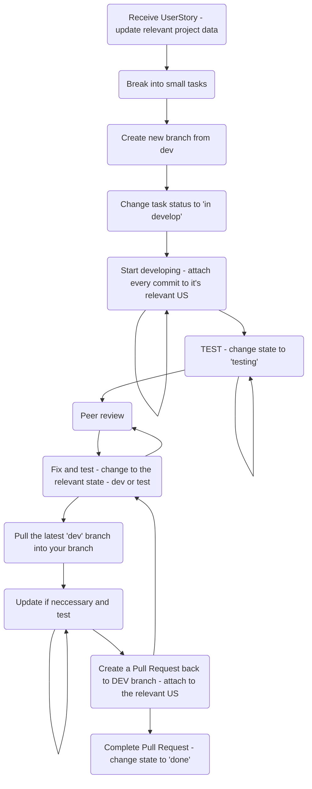

# User Story Methodology

### Motivation
***Working better. faster. together.***
It's not a cheesy slogan (maybe just a little bit..). 
Nowadays every development team that respects itself is working with both [git](https://git-scm.com/) and a task management app,  in our case - [Shortcut](https://shortcut.com/), 
and it is done for a reason.

These tools are super powerful and when a ***team*** knows how to use them - you can see the difference in productivity compared to others.

In order to make the most out of our development process we need to first understand 
how to work with the most basic building blocks.
As we will start adopting this approach and "lifestyle" we will soon enjoy the fruits of our efforts and see a major change in the way we develop.

# The BIG picture

And to be more specific -   

# Project Data

* Project - so we can filter tasks according to project.
* Epic - version or big feature that contains all child user stories.
* Iteration - to see our progress - how many tasks did we actually manage to finish in one iteration
* Type - to filter bugs and features (want to check if someone already solved a similar bug and how?)
* Due - **end of iteration**
* Estimate - when do you think you'll finish it - mostly to make *you* better - challenge yourself. The deadline we promise to others is the one we try the most to reach.
* State - update according to your status.

# Break into small tasks
It is a crucial part of ***understanding, designing and estimate*** what we need to do.
***It's OK to add more tasks along the way - we get better over time***

> **Note:** If you think one US is containing to many small tasks - maybe break it into 2 US (or a new epic?).

# Start developing

### Create a new branch from 'dev'
The *develop* branch contains our last stable version. 
Every new feature / bug-fix whatever should start from there.

> **Warning:**  whatever testing branches you want to create for yourselves - **KEEP THEM AT YOUR LOCAL REPOSITORY!**
>
> They are not a part of the development process, but your own learning.

### Start developing(!) and attaching commits

#### *Change the status* 

First, of-course, change the US status to *'start developing'* so your teammates could know what you're working on.

#### *Attaching commits* 

Each commit in our repository should be meaningful and address an issue. This will help us describing the commits better, improve the readability of the repository commits tree, and to reach quickly and easily to anywhere in our development process.

This is important so we can learn from each other, learn from our mistakes and easily find solution to problems we've encountered before.

In addition, it allows us to enjoy the features GitLab is offering to make it easier to work as a large team:
* Add comments on each others code as part of a remote review or to ask questions.
* Share a discussion over a commit 
* Resolve code review notes
* Notify viewers or relevant colleague via email about changes in repository

and there are probably more... 

>**Note:** did you know? when pressing the commit/pull-request link in Shortcut - 
>it opens its description in GitLab so you can view the changes made.

# Testing

**No feature is done before tested. First as a unit, later with the whole system.**
Change the state of US status to *'testing'* to let your teammates/team-leader know about your progress. 

> **Note:** Maybe the testing part will be done by someone else - that way your successor knows where you stopped.

# Peer Review

Usually, a pull request is never approved on the first time. Save yourself the trouble and ask a teammate to review your code.

# Pull latest *'dev'* into your branch

In order to push your changes to the *'dev'* branch - you **must(!)** first align to the latest develop version. 
Otherwise, if any changes have been made since you started working on your US there may be *merge confilcts* or worse - you may accidentally override these changes.

Update your code, if needed, according to the latest changes and test yourself again.

# Create a Pull Request

This is a great occasion, some say - a celebration(!)
You've finished your part and tested everything. 
Before merging your code into a *new development version*, you need the approval of the team-leader / project manager to approve your work.

This is an important review, and it is an important milestone - 
***link the pull request to the US*** so that one can easily access to the full view of everything you did, and now add/remove in the new development version.

> ***TODO:*** add pull request policies to repository
> ***TODO:*** CI/CD system?

After your pull request is approved - change the state of your US to *'done'* to update your teammates and to remove this issue from our backlog.